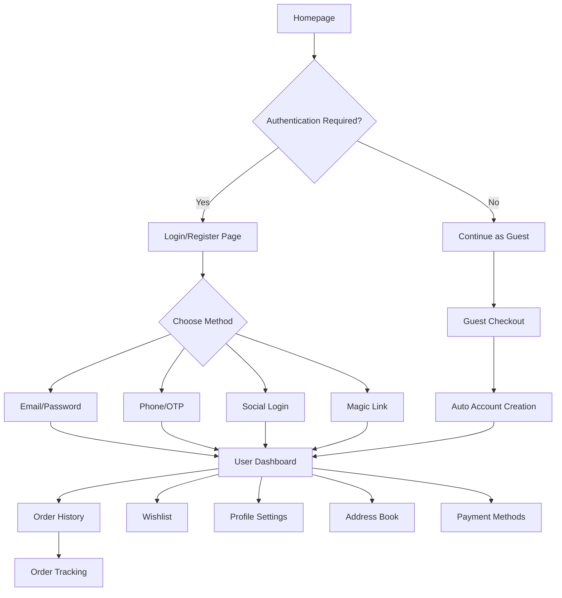

## 1. Product Overview
The Reweave User Account System is a comprehensive customer profile and authentication platform designed to enhance the shopping experience for traditional Malaysian batik products. This system enables secure user registration, seamless authentication, personalized shopping experiences, and complete order management while preserving the cultural heritage shopping journey.

The system addresses the need for personalized user experiences, secure transaction management, and customer retention through loyalty programs. It serves both local Malaysian customers and international batik enthusiasts, providing a modern e-commerce experience while celebrating traditional craftsmanship.

## 2. Core Features

### 2.1 User Roles
| Role | Registration Method | Core Permissions |
|------|---------------------|------------------|
| Guest User | No registration required | Browse products, add to cart, guest checkout |
| Registered Customer | Email/phone/OAuth registration | Full account features, order history, wishlist, loyalty points |
| Premium Customer | Automatic upgrade based on purchase history | Enhanced loyalty benefits, priority support, exclusive offers |

### 2.2 Feature Module
Our user account system consists of the following essential pages:

1. **Login/Register Page**: Multi-method authentication, social login, phone/email signup
2. **User Dashboard**: Personal overview, quick stats, recent activity
3. **Order History Page**: Complete purchase history, order details, tracking
4. **Order Tracking Page**: Real-time shipment status, delivery updates
5. **Wishlist Page**: Saved products, price alerts, stock notifications
6. **Address Book Page**: Multiple shipping addresses, billing addresses
7. **Payment Methods Page**: Saved cards, digital wallets, FPX history
8. **Profile Settings Page**: Personal info, communication preferences, account security
9. **Loyalty Program Page**: Points balance, redemption history, tier status

### 2.3 Page Details
| Page Name | Module Name | Feature description |
|-----------|-------------|---------------------|
| Login/Register | Authentication Gateway | Support email/password, phone/OTP, Google OAuth, Apple OAuth, magic link login. Auto-detect existing accounts during registration. |
| Login/Register | Registration Form | Collect name, email/phone, password with strength indicator. Optional newsletter signup. Auto-verify email/phone via OTP. |
| Login/Register | Social Login | One-click Google and Apple authentication. Auto-merge with existing accounts. Handle profile data import. |
| User Dashboard | Profile Overview | Display user name, loyalty tier, points balance, recent orders count. Quick access to main features. |
| User Dashboard | Recent Activity | Show last 3 orders, recent wishlist additions, loyalty points earned. Link to detailed views. |
| Order History | Order List | Chronological order display with filters (date, status, amount). Pagination for large histories. |
| Order History | Order Details | Complete order information, itemized products, shipping details, payment method, download invoice. |
| Order Tracking | Shipment Status | Real-time tracking with courier integration, estimated delivery, package location map. |
| Order Tracking | Delivery Updates | SMS/email notifications for status changes, delivery scheduling, pickup options. |
| Wishlist | Product Grid | Saved items with current pricing, stock status, quick add to cart, remove items. |
| Wishlist | Price Alerts | Notify when wishlist items go on sale or come back in stock. Set alert preferences. |
| Address Book | Address Management | Add/edit/delete multiple addresses, set default shipping/billing, address validation. |
| Address Book | Address Form | Auto-complete using Google Places API, support Malaysian address formats, postal code validation. |
| Payment Methods | Saved Cards | Secure tokenized card storage, display last 4 digits, expiry date, card type icons. |
| Payment Methods | Digital Wallets | Support Touch'n Go, GrabPay, Boost integration with tokenized payments. |
| Profile Settings | Personal Information | Edit name, email, phone, date of birth, gender. Verify changes via OTP. |
| Profile Settings | Communication Preferences | Opt-in/out email newsletters, SMS promotions, push notifications. Granular category controls. |
| Profile Settings | Security Settings | Change password, enable/disable 2FA, view login history, manage active sessions. |
| Loyalty Program | Points Balance | Display current points, tier status, points expiration dates, progress to next tier. |
| Loyalty Program | Redemption History | Track points earned/spent, redemption details, bonus points from promotions. |

## 3. Core Process

### User Registration Flow
1. User accesses any page with account features → Redirect to login/register
2. Chooses registration method (email, phone, social) → Fill required information
3. System validates uniqueness → Send verification OTP/email
4. User completes verification → Auto-login and redirect to intended page
5. System creates customer profile → Generate loyalty account
6. Welcome email sent → Onboarding tutorial shown

### Authentication Flow
1. User attempts login → Choose authentication method
2. Email/Password: Validate credentials → Check account status
3. Phone/OTP: Send OTP → Validate within 5 minutes
4. Social Login: OAuth handshake → Retrieve profile data
5. Magic Link: Send secure link → Validate one-time use
6. Successful login → Generate secure session → Update last login

### Guest Checkout Integration
1. Guest completes purchase → Collect email/phone during checkout
2. System detects potential existing account → Offer account linking
3. If new customer → Auto-create account with purchase details
4. Send welcome email with temporary password → Include order confirmation
5. Account activation link → Encourage profile completion

### Order Management Flow
1. Order placed → Update order history → Send confirmation
2. Order processed → Update status → Send processing notification
3. Order shipped → Generate tracking number → Send tracking info
4. In transit → Real-time updates → Location notifications
5. Delivered → Confirm delivery → Request feedback → Award loyalty points

## 4. User Interface Design

### 4.1 Design Style
- **Primary Colors**: Deep batik blue (#1e3a8a), warm earth brown (#8b4513), traditional gold (#fbbf24)
- **Secondary Colors**: Soft cream (#fef7ed), forest green (#166534), royal purple (#7c3aed)
- **Button Style**: Rounded corners (8px radius), subtle shadows, hover animations
- **Typography**: Primary - Inter font family, Secondary - Playfair Display for headings
- **Layout Style**: Card-based design with traditional Malaysian patterns as background accents
- **Icons**: Custom batik-inspired icons, Font Awesome for standard UI elements

### 4.2 Page Design Overview
| Page Name | Module Name | UI Elements |
|-----------|-------------|-------------|
| Login/Register | Auth Container | Centered card (400px max-width), batik pattern border, gradient background, social login buttons with brand colors |
| User Dashboard | Profile Header | Circular profile photo (80px), name in Playfair Display 24px, loyalty badge with gold accent |
| User Dashboard | Stats Cards | 3-column responsive grid, icon + number + label, subtle hover effects, batik pattern background |
| Order History | Order Card | White background, batik border accent, product thumbnails (60px), status badges with colors |
| Order Tracking | Timeline | Vertical progress indicator, custom batik-patterned nodes, estimated delivery highlighted |
| Wishlist | Product Grid | 4-column desktop, 2-column mobile, heart toggle animation, price in traditional gold color |
| Address Book | Address Card | White background, edit/delete icons, default badge in primary blue, postal code validation states |
| Payment Methods | Method Card | Card type icons, last 4 digits in monospace, expiry date, security badge icon |

### 4.3 Responsiveness
- **Desktop-First**: Designed for 1440px+ screens, optimized for 1920px
- **Mobile Adaptive**: Breakpoints at 768px (tablet) and 375px (mobile)
- **Touch Optimization**: Larger tap targets (44px minimum), swipe gestures for carousels
- **Progressive Enhancement**: Core functionality works without JavaScript, enhanced experience with modern browsers