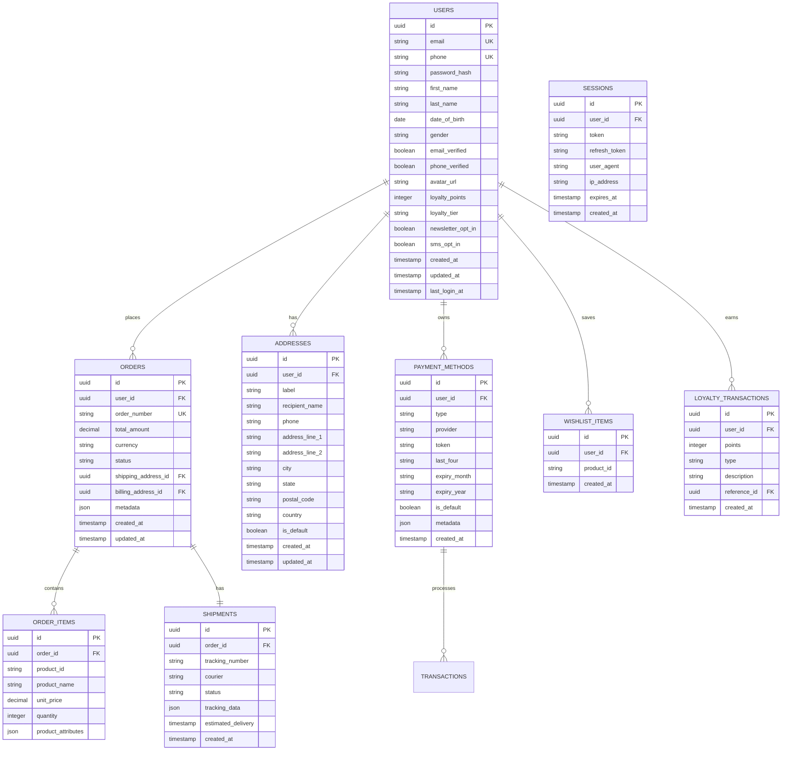

## 1. Architecture Design


## 2. Technology Description

- **Frontend**: React@18 + TailwindCSS@3 + Vite
- **Backend**: Express.js@4 + Node.js@18
- **Database**: Supabase (PostgreSQL@15)
- **Cache**: Redis@7 for session management and rate limiting
- **Authentication**: JWT tokens with refresh token rotation
- **File Storage**: Supabase Storage for user avatars and documents
- **Email Service**: SendGrid for transactional emails
- **SMS Service**: Twilio for OTP delivery
- **Payment Processing**: Stripe for card tokenization, local FPX integration
- **OAuth Providers**: Google OAuth 2.0, Apple Sign In
- **Initialization Tool**: vite-init

## 3. Route Definitions

| Route | Purpose | Authentication |
|-------|---------|----------------|
| /auth/login | Login page with multiple authentication options | Public |
| /auth/register | Registration with email/phone verification | Public |
| /auth/forgot-password | Password reset request | Public |
| /auth/reset-password/:token | Password reset form | Public |
| /auth/verify-email/:token | Email verification | Public |
| /auth/verify-phone | Phone number verification | Public |
| /dashboard | User dashboard overview | Required |
| /profile | Personal information management | Required |
| /orders | Order history and management | Required |
| /orders/:id | Detailed order view with tracking | Required |
| /wishlist | Saved products management | Required |
| /addresses | Shipping address book | Required |
| /payment-methods | Saved payment methods | Required |
| /loyalty | Loyalty program dashboard | Required |
| /settings | Account settings and preferences | Required |
| /api/auth/* | Authentication API endpoints | Mixed |
| /api/users/* | User management API endpoints | Required |
| /api/orders/* | Order management API endpoints | Required |
| /api/wishlist/* | Wishlist management API endpoints | Required |
| /api/addresses/* | Address management API endpoints | Required |
| /api/payments/* | Payment method management API endpoints | Required |
| /api/loyalty/* | Loyalty program API endpoints | Required |

## 4. API Definitions

### 4.1 Authentication APIs

**User Registration**
```
POST /api/auth/register
```

Request:
| Param Name | Param Type | isRequired | Description |
|------------|------------|------------|-------------|
| email | string | false | User email (required if phone not provided) |
| phone | string | false | User phone (required if email not provided) |
| password | string | true | Password (min 8 characters) |
| firstName | string | true | User first name |
| lastName | string | true | User last name |
| newsletter | boolean | false | Opt-in to newsletter |

Response:
```json
{
  "success": true,
  "data": {
    "userId": "uuid-v4",
    "email": "user@example.com",
    "verificationRequired": true,
    "token": "jwt-token"
  }
}
```

**User Login**
```
POST /api/auth/login
```

Request:
| Param Name | Param Type | isRequired | Description |
|------------|------------|------------|-------------|
| email | string | false | User email |
| phone | string | false | User phone |
| password | string | false | User password |
| otp | string | false | One-time password |
| rememberMe | boolean | false | Extended session |

**Social Authentication**
```
POST /api/auth/social/:provider
```

Providers: `google`, `apple`

**Password Reset**
```
POST /api/auth/forgot-password
```

Request:
| Param Name | Param Type | isRequired | Description |
|------------|------------|------------|-------------|
| email | string | true | User email for reset |

**OTP Verification**
```
POST /api/auth/verify-otp
```

Request:
| Param Name | Param Type | isRequired | Description |
|------------|------------|------------|-------------|
| phone | string | true | Phone number |
| otp | string | true | 6-digit OTP code |

### 4.2 User Management APIs

**Get User Profile**
```
GET /api/users/profile
```

**Update User Profile**
```
PUT /api/users/profile
```

Request:
| Param Name | Param Type | isRequired | Description |
|------------|------------|------------|-------------|
| firstName | string | false | First name |
| lastName | string | false | Last name |
| dateOfBirth | string | false | Date of birth (ISO 8601) |
| gender | string | false | Gender (male/female/other) |
| newsletter | boolean | false | Newsletter preference |

**Change Password**
```
PUT /api/users/password
```

Request:
| Param Name | Param Type | isRequired | Description |
|------------|------------|------------|-------------|
| currentPassword | string | true | Current password |
| newPassword | string | true | New password |

### 4.3 Order Management APIs

**Get Order History**
```
GET /api/orders/history
```

Query Parameters:
| Param Name | Param Type | isRequired | Description |
|------------|------------|------------|-------------|
| page | number | false | Page number (default: 1) |
| limit | number | false | Items per page (default: 10) |
| status | string | false | Filter by order status |
| dateFrom | string | false | Start date (ISO 8601) |
| dateTo | string | false | End date (ISO 8601) |

**Get Order Details**
```
GET /api/orders/:orderId
```

**Track Order**
```
GET /api/orders/:orderId/track
```

### 4.4 Wishlist APIs

**Get Wishlist**
```
GET /api/wishlist
```

**Add to Wishlist**
```
POST /api/wishlist
```

Request:
| Param Name | Param Type | isRequired | Description |
|------------|------------|------------|-------------|
| productId | string | true | Product ID |

**Remove from Wishlist**
```
DELETE /api/wishlist/:productId
```

### 4.5 Address Management APIs

**Get Addresses**
```
GET /api/addresses
```

**Add Address**
```
POST /api/addresses
```

Request:
| Param Name | Param Type | isRequired | Description |
|------------|------------|------------|-------------|
| label | string | true | Address label (Home, Work, etc.) |
| recipientName | string | true | Recipient name |
| phone | string | true | Contact phone |
| addressLine1 | string | true | Street address line 1 |
| addressLine2 | string | false | Street address line 2 |
| city | string | true | City |
| state | string | true | State |
| postalCode | string | true | Postal code |
| country | string | true | Country (default: Malaysia) |
| isDefault | boolean | false | Set as default address |

### 4.6 Payment Method APIs

**Get Payment Methods**
```
GET /api/payments/methods
```

**Add Payment Method**
```
POST /api/payments/methods
```

**Delete Payment Method**
```
DELETE /api/payments/methods/:methodId
```

### 4.7 Loyalty Program APIs

**Get Loyalty Points Balance**
```
GET /api/loyalty/balance
```

**Get Points History**
```
GET /api/loyalty/history
```

**Redeem Points**
```
POST /api/loyalty/redeem
```

## 5. Server Architecture Diagram


## 6. Data Model

### 6.1 Database Schema



### 6.2 Database Tables and Indexes

**Users Table**
```sql
CREATE TABLE users (
    id UUID PRIMARY KEY DEFAULT gen_random_uuid(),
    email VARCHAR(255) UNIQUE,
    phone VARCHAR(20) UNIQUE,
    password_hash VARCHAR(255) NOT NULL,
    first_name VARCHAR(100) NOT NULL,
    last_name VARCHAR(100) NOT NULL,
    date_of_birth DATE,
    gender VARCHAR(10) CHECK (gender IN ('male', 'female', 'other')),
    email_verified BOOLEAN DEFAULT FALSE,
    phone_verified BOOLEAN DEFAULT FALSE,
    avatar_url TEXT,
    loyalty_points INTEGER DEFAULT 0,
    loyalty_tier VARCHAR(20) DEFAULT 'bronze',
    newsletter_opt_in BOOLEAN DEFAULT FALSE,
    sms_opt_in BOOLEAN DEFAULT FALSE,
    created_at TIMESTAMP WITH TIME ZONE DEFAULT NOW(),
    updated_at TIMESTAMP WITH TIME ZONE DEFAULT NOW(),
    last_login_at TIMESTAMP WITH TIME ZONE
);

CREATE INDEX idx_users_email ON users(email);
CREATE INDEX idx_users_phone ON users(phone);
CREATE INDEX idx_users_loyalty_tier ON users(loyalty_tier);
```

**Orders Table**
```sql
CREATE TABLE orders (
    id UUID PRIMARY KEY DEFAULT gen_random_uuid(),
    user_id UUID REFERENCES users(id) ON DELETE CASCADE,
    order_number VARCHAR(50) UNIQUE NOT NULL,
    total_amount DECIMAL(10,2) NOT NULL,
    currency VARCHAR(3) DEFAULT 'MYR',
    status VARCHAR(50) NOT NULL DEFAULT 'pending',
    shipping_address_id UUID REFERENCES addresses(id),
    billing_address_id UUID REFERENCES addresses(id),
    metadata JSONB,
    created_at TIMESTAMP WITH TIME ZONE DEFAULT NOW(),
    updated_at TIMESTAMP WITH TIME ZONE DEFAULT NOW()
);

CREATE INDEX idx_orders_user_id ON orders(user_id);
CREATE INDEX idx_orders_order_number ON orders(order_number);
CREATE INDEX idx_orders_status ON orders(status);
CREATE INDEX idx_orders_created_at ON orders(created_at DESC);
```

**Sessions Table**
```sql
CREATE TABLE sessions (
    id UUID PRIMARY KEY DEFAULT gen_random_uuid(),
    user_id UUID REFERENCES users(id) ON DELETE CASCADE,
    token VARCHAR(255) UNIQUE NOT NULL,
    refresh_token VARCHAR(255) UNIQUE NOT NULL,
    user_agent TEXT,
    ip_address INET,
    expires_at TIMESTAMP WITH TIME ZONE NOT NULL,
    created_at TIMESTAMP WITH TIME ZONE DEFAULT NOW()
);

CREATE INDEX idx_sessions_user_id ON sessions(user_id);
CREATE INDEX idx_sessions_token ON sessions(token);
CREATE INDEX idx_sessions_refresh_token ON sessions(refresh_token);
CREATE INDEX idx_sessions_expires_at ON sessions(expires_at);
```

## 7. Security Considerations

### 7.1 Authentication Security
- **Password Requirements**: Minimum 8 characters, uppercase, lowercase, number, special character
- **JWT Implementation**: RS256 algorithm, 15-minute access token expiry, 7-day refresh token
- **Rate Limiting**: 5 login attempts per 15 minutes, progressive delays
- **Session Management**: Secure HTTP-only cookies, CSRF protection, concurrent session limits

### 7.2 Data Protection
- **Encryption**: bcrypt for passwords (12 rounds), AES-256 for sensitive data at rest
- **PII Handling**: Encrypt personal data, implement data retention policies
- **GDPR Compliance**: Right to deletion, data portability, consent management
- **Audit Logging**: Track all authentication events, data access, profile changes

### 7.3 API Security
- **Input Validation**: Strict validation on all endpoints, SQL injection prevention
- **CORS Configuration**: Whitelist allowed origins, restrict methods and headers
- **API Rate Limiting**: Tiered limits based on authentication status
- **Error Handling**: Generic error messages, sensitive information protection

### 7.4 Payment Security
- **PCI DSS Compliance**: Tokenized payment methods, no card data storage
- **3D Secure**: Implement for card payments, fraud detection
- **Audit Trail**: Complete transaction logging, reconciliation reports
- **Secure Communication**: TLS 1.3 for all payment-related communications